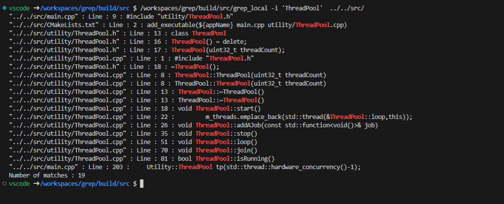

# 'GREP_LOCAL' Application
By R.Thrimawithana

## Introduction
A simple linux like grep command line application to do a recursive search of a given query in all files in a directory.

## Installation.
### System requirement(s)
CMake version 3.16 or above
Compilers
&ensp;    GCC 11.4 or above (CMake supported c++20 compatible compiler)
&ensp;    Clang 14.0 or above (CMake supported c++20 compatible compiler)

### instructions to build.
1. Move to root folder.
2. >>mkdir build
3. >>cd build
4. >>cmake ..
5. >>make -j\<threads>    number of threads for build.

## Tested version(s)
Ubuntu 22.04 with GCC 11.4 & cmake 3.22
Ubuntu 22.04 with Clang 14.0 & cmake 3.22

## Running instructions:

\>> grep_local \<options> \<pattern> \<folder>

*Option(s)*
&ensp; -c Print only count of the lines that match the exact pattern.
&ensp; -i Ignores case for matching and Disply the  matched lines and their line numbers.
&ensp; -l Display list of a filenames matches the exact pattern.
&ensp; -n Dispaly the matched lines and their line number that match the exact pattern.
&ensp; -\<x> any other option act as -n. 

### Application usage

Search with ignoring case 'ThreadPool' in ../../src folder
grep_local -i 'ThreadPool'  ../../src/

## Design consideration:
Only C++ standard library dependancy.
Use c++ 20 standard library.
&ensp; - The version 20 uses due to availablity of std::filesystem and std::jthread features.
Multi-threaded application with usage of all the cores.
std::regex features use to find matches.

### Multi-threading 
Application use single main thread to general application tasks such as reading parameters, excecuting std::filesystem search, waiting for completion. Main thread does not use for search through content.
Thread pool has created to accomadate multi-threaded search.

#### Usage of thread pool
The application can have any number of files to search and practically number exceeds the number of phyical threads in the system. Usage of thread pool will improve the running efficiency by not creating and destroying threads in large number of file search. 
Thuis also use job queue and will automatically start new job if one thread finishes the assigned job.
Threadpool uses <b>std::jthread</b> which inherantly have joinalble property, which is simplifing user distruction handling.
